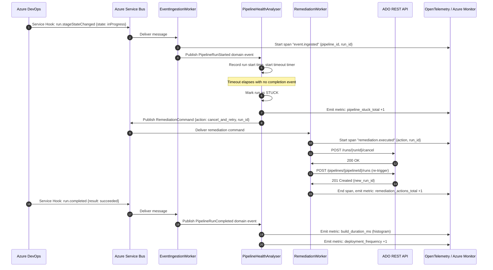
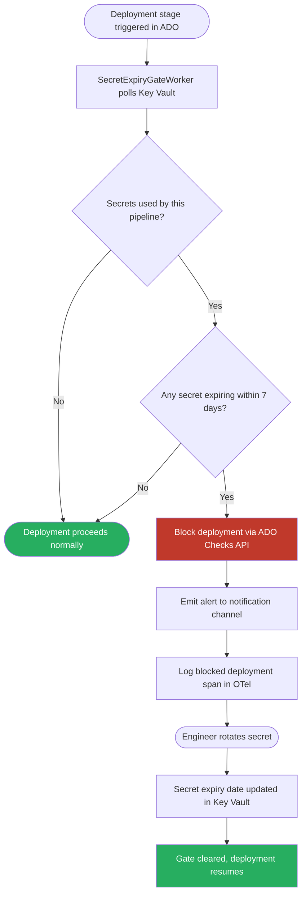

# PipelineForge

> A self-healing CI/CD observability platform that monitors Azure DevOps pipelines, auto-triggers remediation workflows, and surfaces DORA metrics via Grafana dashboards.

[](https://dotnet.microsoft.com/)
[](https://azure.microsoft.com/en-us/products/devops)
[](https://opentelemetry.io/)
[](https://grafana.com/)
[](LICENSE)

---

## Overview

PipelineForge is an event-driven observability and self-healing platform for Azure DevOps CI/CD pipelines. It consumes Azure DevOps **Service Hook** webhook events via **Azure Service Bus**, detects stuck or failed pipeline runs, and automatically triggers remediation workflows. All pipeline activity is instrumented with **OpenTelemetry** (traces + metrics) and exported to **Azure Monitor**, with **Grafana** dashboards surfacing key DORA metrics in real time.

An integrated **alerting engine** cross-references live pipeline state with **Azure Key Vault** secret expiry windows, proactively blocking deployments that rely on near-expiry credentials before they fail in production.

### Key Features

- Real-time Azure DevOps webhook event ingestion via Azure Service Bus
- Automatic detection and remediation of stuck/failed pipeline runs
- Full OpenTelemetry instrumentation (distributed traces + custom metrics)
- Grafana dashboards: p95 build duration, failure rate, deployment frequency
- DORA metrics: Lead Time for Changes, Deployment Frequency, Change Failure Rate, MTTR
- Azure Key Vault secret expiry alerting with deployment gate blocking
- .NET Worker Service architecture for reliable background processing
- Dead-letter queue handling for unprocessable events

---

## Architecture

### High-Level System Architecture

```
┌────────────────────────────────────────────────────────────────────────┐
│                        AZURE DEVOPS                                    │
│                                                                        │
│  Pipeline runs → Service Hook events (build.complete, run.stageStateChanged, │
│                                        ms.vss-release.deployment-*)   │
└──────────────────────────────┬─────────────────────────────────────────┘
                               │ HTTPS webhook POST
                               ▼
┌──────────────────────────────────────────────────────────────────────┐
│                     AZURE SERVICE BUS                                │
│                                                                      │
│  ┌─────────────────────────┐    ┌─────────────────────────────────┐ │
│  │  pipeline-events topic  │    │  remediation-commands topic     │ │
│  │  (fan-out to consumers) │    │  (retry / re-trigger actions)   │ │
│  └─────────────┬───────────┘    └──────────────────┬──────────────┘ │
└────────────────┼──────────────────────────────────── ┼───────────────┘
                 │                                      │
                 ▼                                      ▼
┌───────────────────────────────────────────────────────────────────────┐
│                       PIPELINEFORGE SERVICE                           │
│                        (.NET 8 Worker Services)                       │
│                                                                       │
│  ┌──────────────────────────────────────────────────────────────────┐ │
│  │  EventIngestionWorker                                            │ │
│  │  • Subscribes to pipeline-events topic                          │ │
│  │  • Deserialises ADO webhook payloads                            │ │
│  │  • Publishes typed domain events to in-process channel          │ │
│  └──────────────────────────────────────────────────────────────────┘ │
│                                                                       │
│  ┌──────────────────────────────────────────────────────────────────┐ │
│  │  PipelineHealthAnalyser                                          │ │
│  │  • Tracks pipeline run state machine (queued→running→complete)  │ │
│  │  • Detects stuck runs (configurable timeout per pipeline)       │ │
│  │  • Detects repeated failure patterns (N failures in T minutes)  │ │
│  │  • Publishes remediation commands to Service Bus                │ │
│  └──────────────────────────────────────────────────────────────────┘ │
│                                                                       │
│  ┌──────────────────────────────────────────────────────────────────┐ │
│  │  RemediationWorker                                               │ │
│  │  • Consumes remediation-commands topic                          │ │
│  │  • Calls Azure DevOps REST API to re-trigger or cancel runs     │ │
│  │  • Logs remediation actions with full trace context             │ │
│  └──────────────────────────────────────────────────────────────────┘ │
│                                                                       │
│  ┌──────────────────────────────────────────────────────────────────┐ │
│  │  SecretExpiryGateWorker                                          │ │
│  │  • Polls Azure Key Vault for secret expiry metadata             │ │
│  │  • Cross-references with active pipeline deployment stages      │ │
│  │  • Blocks deployments using secrets expiring within N days      │ │
│  │  • Sends alerts to configured notification channels            │ │
│  └──────────────────────────────────────────────────────────────────┘ │
│                                                                       │
│  ┌──────────────────────────────────────────────────────────────────┐ │
│  │  OpenTelemetry Instrumentation Layer                             │ │
│  │  • Traces: span per event, per analysis, per remediation action │ │
│  │  • Metrics: build_duration_ms (histogram), pipeline_failure_    │ │
│  │    total (counter), deployment_frequency (gauge), MTTR (gauge) │ │
│  │  • Export: OTLP → Azure Monitor                                 │ │
│  └──────────────────────────────────────────────────────────────────┘ │
└──────────────────────────────────┬────────────────────────────────────┘
                                   │ OTLP export
                                   ▼
┌───────────────────────────────────────────────────────────────────────┐
│                OBSERVABILITY STACK                                    │
│                                                                       │
│  ┌─────────────────────┐    ┌──────────────────────────────────────┐ │
│  │  Azure Monitor      │    │  Grafana                             │ │
│  │  (traces + metrics) │───▶│  Dashboards:                         │ │
│  │                     │    │  • DORA Metrics overview             │ │
│  └─────────────────────┘    │  • p95 build duration by pipeline   │ │
│                             │  • Failure rate (7d rolling)        │ │
│  ┌─────────────────────┐    │  • Deployment frequency             │ │
│  │  Azure Key Vault    │    │  • Secret expiry timeline           │ │
│  │  (secret metadata)  │    └──────────────────────────────────────┘ │
│  └─────────────────────┘                                             │
└───────────────────────────────────────────────────────────────────────┘
```

### Event Flow: Stuck Pipeline Detection & Remediation



### Secret Expiry Gate Flow



### DORA Metrics Tracked

```
┌─────────────────────────────────────────────────────────────────┐
│                     DORA METRICS DASHBOARD                      │
│                                                                 │
│  Deployment Frequency          Lead Time for Changes            │
│  ┌──────────────────────┐     ┌──────────────────────────────┐  │
│  │ Measured by counting │     │ Time from first commit to    │  │
│  │ successful pipeline  │     │ deployment completion,       │  │
│  │ run completions per  │     │ computed from ADO work item  │  │
│  │ day / week           │     │ timestamps + run events      │  │
│  └──────────────────────┘     └──────────────────────────────┘  │
│                                                                 │
│  Change Failure Rate           Mean Time to Restore (MTTR)     │
│  ┌──────────────────────┐     ┌──────────────────────────────┐  │
│  │ % of deployments     │     │ Time between a failed        │  │
│  │ resulting in a failed│     │ deployment and the next      │  │
│  │ run within 1hr of    │     │ successful one on the same   │  │
│  │ completion           │     │ pipeline                     │  │
│  └──────────────────────┘     └──────────────────────────────┘  │
└─────────────────────────────────────────────────────────────────┘
```

---

## Tech Stack

| Layer | Technology |
|---|---|
| Runtime | .NET 8, Worker Services |
| Messaging | Azure Service Bus (topics + subscriptions) |
| Event Source | Azure DevOps Service Hooks (webhooks) |
| Key Management | Azure Key Vault |
| Observability | OpenTelemetry SDK (.NET), Azure Monitor, Grafana |
| ADO Integration | Azure DevOps REST API (via `Microsoft.TeamFoundationServer.Client`) |
| Persistence | Azure Table Storage (pipeline state), SQL Server (audit log) |
| Alerting | Azure Monitor Alerts, configurable webhook notifications |

---

## Project Structure

```
PipelineForge/
├── src/
│   ├── PipelineForge.Workers/           # .NET Worker Services (entry point)
│   │   ├── EventIngestionWorker.cs
│   │   ├── RemediationWorker.cs
│   │   ├── SecretExpiryGateWorker.cs
│   │   └── Program.cs
│   ├── PipelineForge.Core/              # Domain logic
│   │   ├── Events/
│   │   │   ├── PipelineRunStarted.cs
│   │   │   ├── PipelineRunCompleted.cs
│   │   │   └── PipelineRunFailed.cs
│   │   ├── Analysis/
│   │   │   ├── PipelineHealthAnalyser.cs
│   │   │   └── StuckRunDetector.cs
│   │   ├── Remediation/
│   │   │   └── RemediationCommandHandler.cs
│   │   └── Gates/
│   │       └── SecretExpiryGate.cs
│   ├── PipelineForge.Infrastructure/    # Azure SDK integrations
│   │   ├── AzureDevOps/
│   │   │   ├── AdoWebhookReceiver.cs
│   │   │   └── AdoRestClient.cs
│   │   ├── ServiceBus/
│   │   │   └── ServiceBusPublisher.cs
│   │   ├── KeyVault/
│   │   │   └── SecretMetadataReader.cs
│   │   └── Telemetry/
│   │       └── OtelInstrumentation.cs   # OpenTelemetry setup
│   └── PipelineForge.Tests/
│       ├── Unit/
│       └── Integration/
├── dashboards/
│   ├── dora-metrics.json                # Grafana dashboard JSON
│   └── pipeline-health.json
├── infra/
│   └── main.bicep                       # Azure infra as code (Bicep)
├── docker-compose.yml
└── README.md
```

---

## Getting Started

### Prerequisites

- .NET 8 SDK
- Azure subscription with:
  - Azure Service Bus namespace (Standard tier or above for topics)
  - Azure Key Vault
  - Azure Monitor workspace
- Azure DevOps organisation (to configure Service Hooks)
- Grafana instance (or Azure Managed Grafana)

### Configuration

```json
{
  "AzureServiceBus": {
    "ConnectionString": "<your-service-bus-connection-string>",
    "PipelineEventsTopic": "pipeline-events",
    "RemediationCommandsTopic": "remediation-commands",
    "SubscriptionName": "pipelineforge-worker"
  },
  "AzureDevOps": {
    "OrganisationUrl": "https://dev.azure.com/<your-org>",
    "PersonalAccessToken": "<your-pat>"
  },
  "KeyVault": {
    "Uri": "https://<your-keyvault>.vault.azure.net/",
    "SecretExpiryWarningDays": 7
  },
  "OpenTelemetry": {
    "Endpoint": "https://<your-azure-monitor-endpoint>"
  }
}
```

### Run Locally

```bash
git clone https://github.com/K-riti/PipelineForge.git
cd PipelineForge
dotnet restore
dotnet run --project src/PipelineForge.Workers
```

### Configure Azure DevOps Service Hook

1. In your Azure DevOps project, go to **Project Settings → Service hooks**
2. Click **+ Create subscription** → select **Web Hooks**
3. Choose events: `Build completed`, `Run stage state changed`, `Release deployment completed`
4. Set the URL to your PipelineForge webhook receiver endpoint
5. PipelineForge will start receiving events immediately

### Import Grafana Dashboards

```bash
# Import the pre-built dashboards
curl -X POST http://your-grafana/api/dashboards/import \
  -H "Content-Type: application/json" \
  -d @dashboards/dora-metrics.json
```

---

## Dead-Letter Queue Handling

Events that fail processing after 3 retries are moved to the dead-letter sub-queue. PipelineForge exposes a `/admin/dlq` endpoint to inspect and replay dead-lettered messages, with full trace context preserved for debugging.

---

## License

MIT — see [LICENSE](LICENSE) for details.
